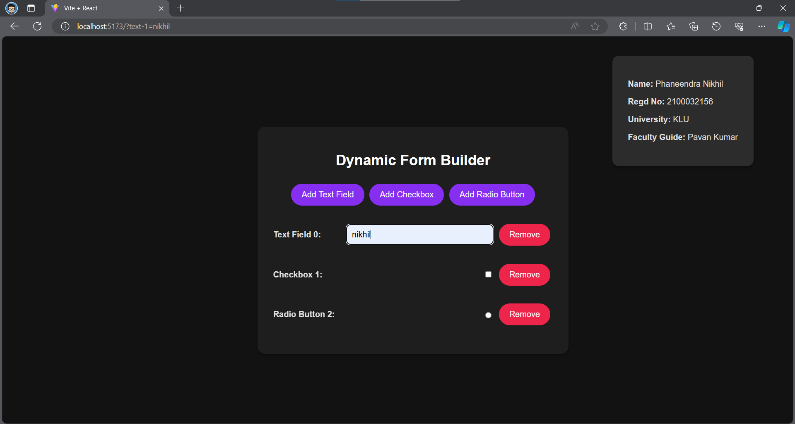
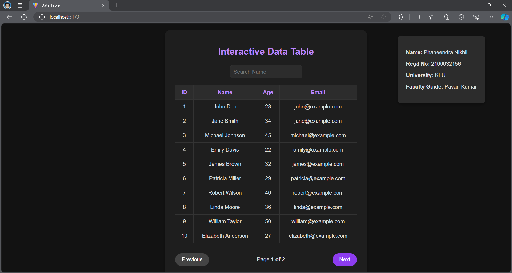
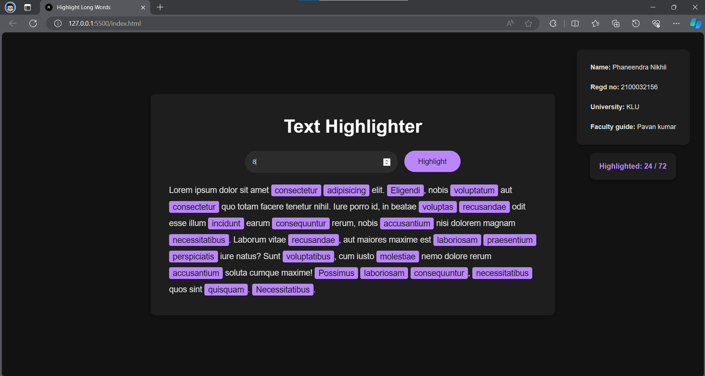

# Web Development Projects

This repository contains three web development projects built using different technologies:

1. **Dynamic Form Builder (React)**: A web application developed using React.js that allows users to add and remove form fields dynamically.

2. **Interactive Data Table (React)**: A web application developed using React.js that enables users to sort columns, filter rows, and paginate results efficiently.

3. **Text Highlighter (HTML)**: A web utility developed using HTML, CSS, and JavaScript that extracts text from a paragraph tag and highlights words longer than a specified length.

## Project Previews

1. **Dynamic Form Builder (React)**:
   
   

3. **Interactive Data Table (React)**:
   
   

5. **Text Highlighter (HTML)**:
   
   

## Usage

1. Clone the repository: ```https://github.com/phaneendra-nikhil/frontend_2100032156.git```

2. Navigate to each project directory (`dynamic-form-generate`, `data-table`, `word-extraction`) and follow the respective usage instructions in their README files.

## Author

Phaneendra Nikhil

