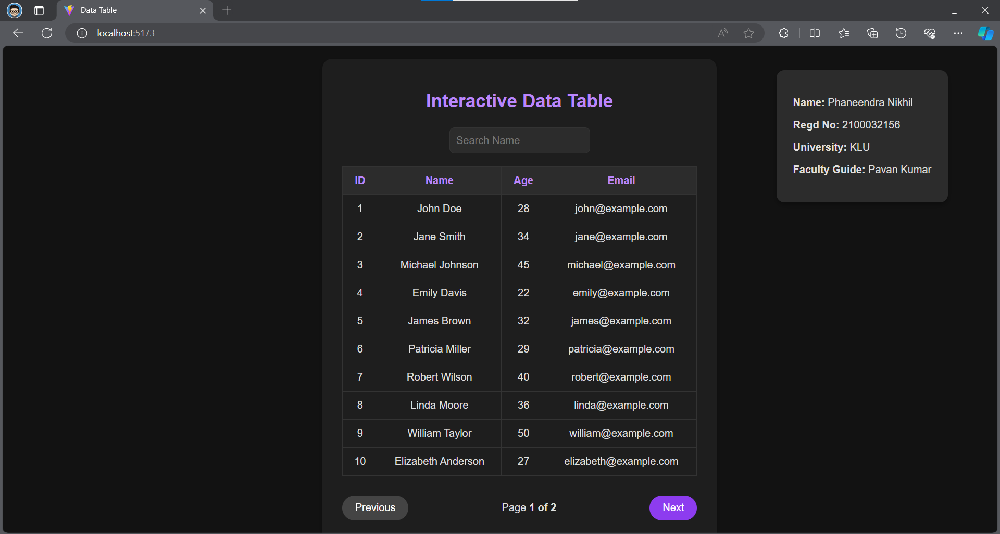

## Project 2: Interactive Data Table (React)

### Description
The Interactive Data Table is a web application developed using React.js that allows users to sort columns, filter rows, and paginate results efficiently. It provides a smooth user experience, even with large datasets.

### Features
- Sorting columns alphabetically or numerically.
- Filtering rows based on specific criteria.
- Pagination for easy navigation through results.
- Developed using React.js for dynamic functionality.

### Usage
1. Clone the repository.
2. Install dependencies using `npm install`.
3. Run the development server using `npm start`.
4. Open the application in a web browser.

### Preview

### Author
Phaneendra Nikhil

