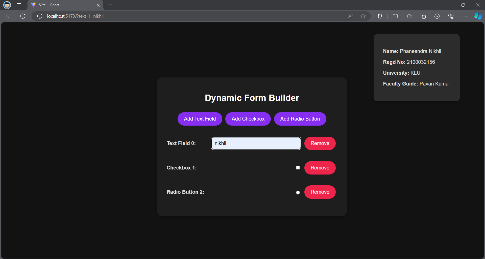

## Project 1: Dynamic Form Builder (React)

### Description
The Dynamic Form Builder is a web application developed using React.js that allows users to add and remove form fields dynamically. It supports various field types such as text inputs, checkboxes, and radio buttons.

### Features
- Add and remove form fields on the fly.
- Supports text inputs, checkboxes, and radio buttons.
- Developed using React.js for dynamic functionality.

### Usage
1. Clone the repository.
2. Install dependencies using `npm install`.
3. Run the development server using `npm start`.
4. Open the application in a web browser.

### Preview

### Author
Phaneendra Nikhil
